# Movie Archive — Project Report

> **Course:** Web Programming — Semester 6
> **Stack:** FastAPI · MySQL · React 19 · Vite · Bootstrap 5

---

## Table of Contents

1. [Overview & Business Problem](#1-overview--business-problem)
2. [Project Structure](#2-project-structure)
3. [How to Run](#3-how-to-run)
4. [Features](#4-features)
5. [Week 1 — Web Fundamentals](#5-week-1--web-fundamentals)
6. [Week 2 — Database Design & FastAPI](#6-week-2--database-design--fastapi)
7. [Week 3 — Production-Ready APIs & External Integrations](#7-week-3--production-ready-apis--external-integrations)
8. [Week 4 — React + Vite Frontend](#8-week-4--react--vite-frontend)

---

## 1. Overview & Business Problem

### What is Movie Archive?

Movie Archive is a full-stack web application for discovering, tracking, and rating movies and TV series. Users browse a curated catalogue, maintain personal watchlists, record what they have watched, and rate titles with optional written reviews. Administrators grow the catalogue by uploading CSV files of IMDb IDs and triggering a background sync with the OMDb API to enrich every title with metadata, posters, cast, and — for TV series — full season/episode breakdowns.

### The Business Problem

Existing platforms like Letterboxd or IMDb are read-heavy and social by design. There is a clear gap for a **private, self-hosted archive** where a team or individual can:

- **Curate** a specific catalogue rather than all 10 million IMDb titles.
- **Tag** titles with custom labels (admin-controlled quality assurance).
- **Track** viewing habits without surrendering data to a third-party platform.
- **Rate** content on a consistent personal scale and retain the reviews.
- **Monitor TV series** progress at the season and episode level.

The application solves this with a RESTful API backend, a reactive single-page frontend, and a structured relational database that models the real-world relationships between users, titles, genres, cast, watchlists, ratings, and viewing history.

### Screenshots

| Home (unauthenticated) | Home (logged in) | Filters applied |
|---|---|---|
|  | 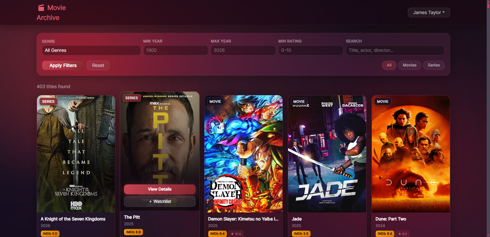 | 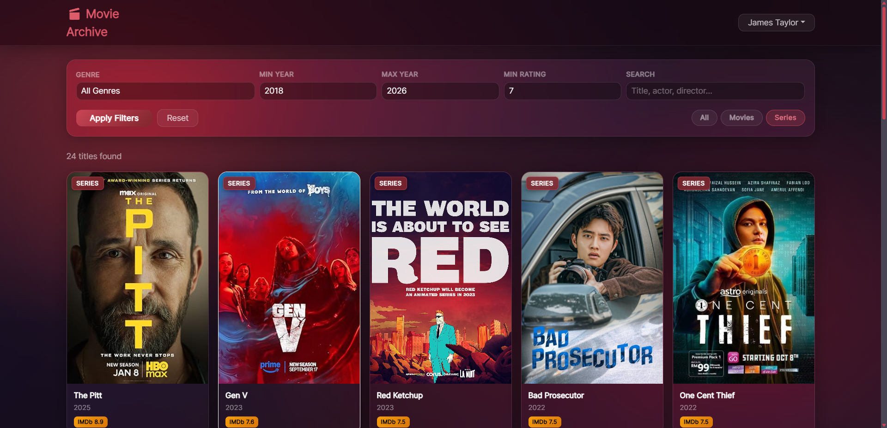 |

| Movie Detail | TV Show Detail (seasons accordion) | Watch History |
|---|---|---|
| 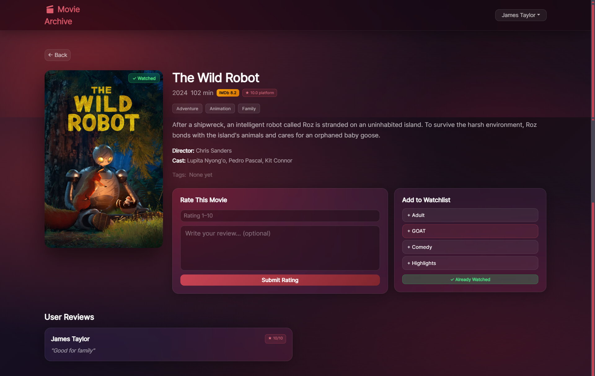 |  |  |

| Watchlists | Admin CSV Upload | Admin Sync (running) |
|---|---|---|
| 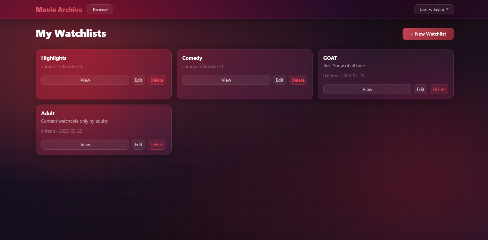 |  | 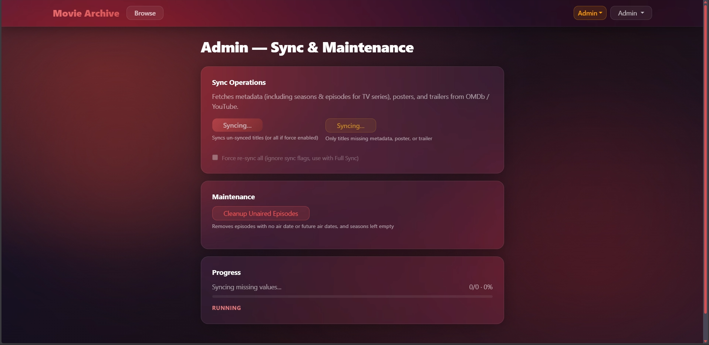 |

---

## 2. Project Structure

```
movie_archive/
│
├── backend/                        # FastAPI application
│   ├── main.py                     # App factory, CORS, lifespan, router registration
│   ├── config.py                   # Pydantic-Settings — loads .env
│   ├── database.py                 # SQLAlchemy engine + get_session dependency
│   ├── models.py                   # SQLModel ORM table classes (15 tables)
│   ├── schemas.py                  # Pydantic request/response schemas
│   ├── services.py                 # All business logic (fat service, thin routes)
│   ├── dependencies.py             # get_current_user, get_optional_user, require_admin
│   ├── requirements.txt            # Python dependencies
│   ├── .env                        # Secrets — not committed to version control
│   └── routers/
│       ├── users.py                # POST /auth/register, /auth/login, GET /auth/me
│       ├── shows.py                # GET /shows, /shows/{id}, /shows/genres, /shows/{id}/seasons
│       ├── ratings.py              # POST/PUT/DELETE /ratings
│       ├── watchlists.py           # CRUD /watchlists and /watchlists/{id}/shows
│       ├── history.py              # GET /history, POST /history/{show_id}
│       ├── tags.py                 # GET/POST /tags, POST /shows/{id}/tags (admin-only)
│       ├── collections.py          # CRUD /collections (data model layer)
│       └── external.py             # POST /admin/sync/start, GET /admin/sync/status,
│                                   # POST /admin/upload-csv, GET /admin/omdb/search
│
├── db/
│   ├── 1- Movie_Archive_DB.sql     # Schema: all CREATE TABLE + ALTER TABLE migrations
│   ├── 2- Procedures.sql           # Stored procedures and views
│   └── 3- Insertions.sql           # Seed data (users, shows, genres, cast, watchlists)
│
├── frontend/                       # React 19 + Vite SPA
│   ├── vite.config.js              # Vite config with dev-proxy to backend
│   ├── index.html                  # HTML shell
│   └── src/
│       ├── main.jsx                # ReactDOM.createRoot entry point
│       ├── App.jsx                 # BrowserRouter, Routes, AmbientOrbs background
│       ├── index.css               # Glassmorphism design system + Bootstrap overrides
│       ├── api/
│       │   └── client.js           # Axios instance — base URL + JWT interceptor
│       ├── context/
│       │   └── AuthContext.jsx     # JWT token + user state (React Context API)
│       ├── components/
│       │   ├── Navbar.jsx          # Sticky glass navbar with user/admin dropdowns
│       │   ├── MovieCard.jsx       # Reusable movie card with hover overlay
│       │   ├── PosterImage.jsx     # Smart poster with OMDb API fallback
│       │   └── ErrorBanner.jsx     # Dismissible error alert
│       └── pages/
│           ├── HomePage.jsx        # Browse + filter catalogue
│           ├── ShowDetailPage.jsx  # Full metadata, rating form, seasons accordion
│           ├── LoginPage.jsx       # JWT login with password visibility toggle
│           ├── RegisterPage.jsx    # Account creation with password confirmation
│           ├── WatchlistsPage.jsx  # Manage watchlists
│           ├── WatchlistDetailPage.jsx
│           ├── HistoryPage.jsx     # View watch history with ratings
│           ├── AdminUploadPage.jsx # CSV bulk upload
│           └── AdminSyncPage.jsx   # Real-time OMDb sync with progress bar
│
├── screenshots/                    # 37 Playwright-captured screenshots
├── responsibilities/               # Team member responsibility breakdowns
└── REPORT.md                       # This file
```

---

## 3. How to Run

### Prerequisites

| Tool | Version |
|------|---------|
| Python | 3.11+ |
| Node.js | 20+ |
| MySQL | 8.0+ |

### Step 1 — Database Setup

Run the three SQL files **in order** against a running MySQL instance:

```bash
mysql -u root -p < "db/1- Movie_Archive_DB.sql"
mysql -u root -p movie_archive < "db/2- Procedures.sql"
mysql -u root -p movie_archive < "db/3- Insertions.sql"
```

**What each file does:**

| File | Contents |
|------|----------|
| `1- Movie_Archive_DB.sql` | Creates the `movie_archive` database and all **15 tables**: `users`, `shows`, `genres`, `show_genres`, `directors`, `show_directors`, `actors`, `show_actors`, `watchlists`, `watchlist_items`, `user_ratings`, `watch_history`, `tags`, `show_tags`, `seasons`, `episodes`. Also includes `ALTER TABLE` migrations that add `show_type` and `total_seasons` columns to `shows`, the `UNIQUE KEY uq_watch_history_user_show` deduplication constraint on `watch_history`, and performance indexes. |
| `2- Procedures.sql` | Drops and recreates all stored procedures: `sp_rate_show`, `sp_mark_as_watched`, `sp_create_watchlist`, `sp_delete_watchlist`, `sp_add_to_watchlist`, `sp_remove_from_watchlist`, `sp_insert_show_if_not_exists`. |
| `3- Insertions.sql` | Seeds the database with 8 users (including one admin), 18 movies, 8 genres, 13 directors, 44 actors, all join-table mappings, 12 watchlists with items, user ratings, watch history, and 8 tags. |

### Step 2 — Backend

```bash
cd backend
python -m venv venv
source venv/bin/activate          # Windows: venv\Scripts\activate
pip install -r requirements.txt
```

Create `backend/.env`:

```env
DB_HOST=
DB_PORT=3306
DB_USER=
DB_PASSWORD=your_password
DB_NAME=movie_archive
SECRET_KEY=your_jwt_secret_key_here
ALGORITHM=HS256
ACCESS_TOKEN_EXPIRE_MINUTES=60
OMDB_API_KEY=
ADMIN_USER_ID=
```

Start the server:

```bash
uvicorn main:app --reload --port 8000
```

Interactive API docs: `http://localhost:8000/docs`

### Step 3 — Frontend

```bash
cd frontend
npm install
npm run dev
```

App runs at `http://localhost:5173`.

### Default Admin Account

```
Email:    admin@moviearchive.com
Password: admin.movie.archive
```

---

## 4. Features

### Public (No Login Required)

- **Browse catalogue** — full grid of all movies and TV series with poster images
- **Filter & search** — by genre, release year range, minimum IMDb rating, and free-text search across titles, actors, and directors
- **Show detail** — poster, plot, cast, genres, IMDb rating, platform average rating, user reviews; for TV series: full seasons and episodes accordion

| Browse (logged out) | Filters applied | Movie detail |
|---|---|---|
|  |  |  |

TV series detail shows an additional seasons/episodes accordion not present on movie pages:


### Authenticated Users

- **Register / Login** — JWT-based authentication; passwords hashed with bcrypt
- **Rate & review** — submit a 1–10 rating with an optional text review; submitting a rating automatically marks the title as watched
- **Mark as watched** — manually record a title in watch history without rating
- **Watch history** — chronological list of watched titles with ratings and review excerpts
- **Watchlists** — create named watchlists with descriptions, add/remove titles, delete lists

| Login | Register | Watch History |
|---|---|---|
|  |  |  |

| Watchlists | Watchlist Detail | Quick-add from card |
|---|---|---|
|  | 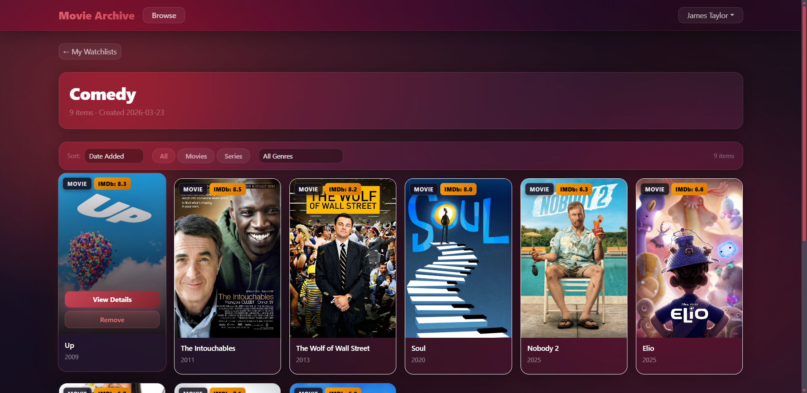 | 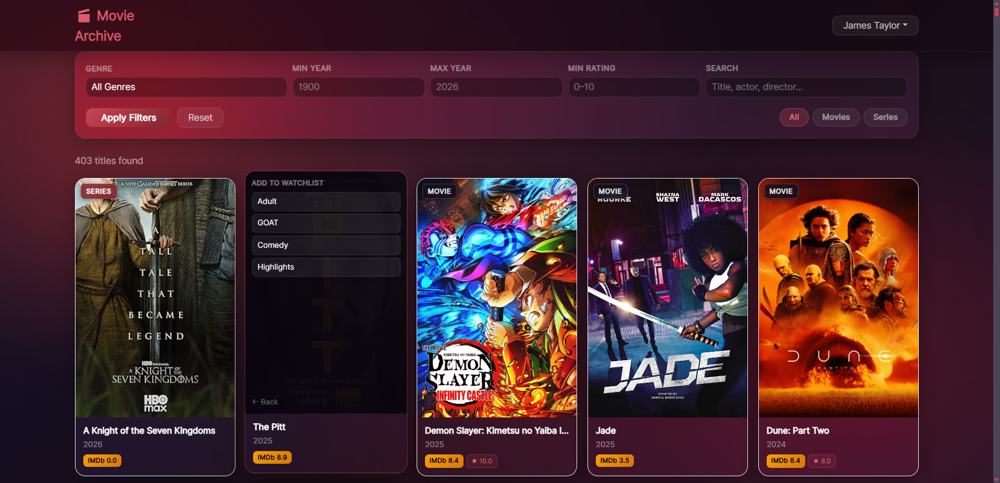 |

### Admin Only

- **Upload CSV** — bulk-register new titles by uploading a plain-text file of IMDb IDs
- **OMDb Sync** — background job that fetches full metadata, posters, genres, cast, and season/episode data for every title; real-time progress bar polled every 2 seconds
- **Tag management** — create tags and apply them to titles for custom labelling

| CSV Upload | Upload Result | Sync Running | Sync Complete |
|---|---|---|---|
|  | 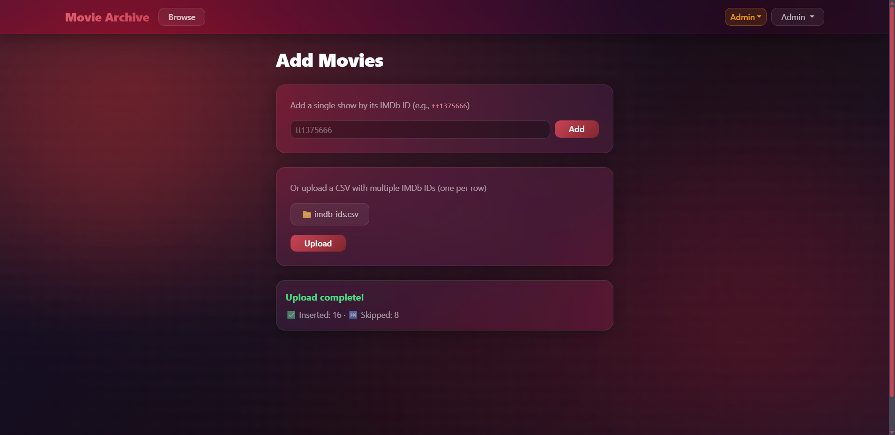 |  | 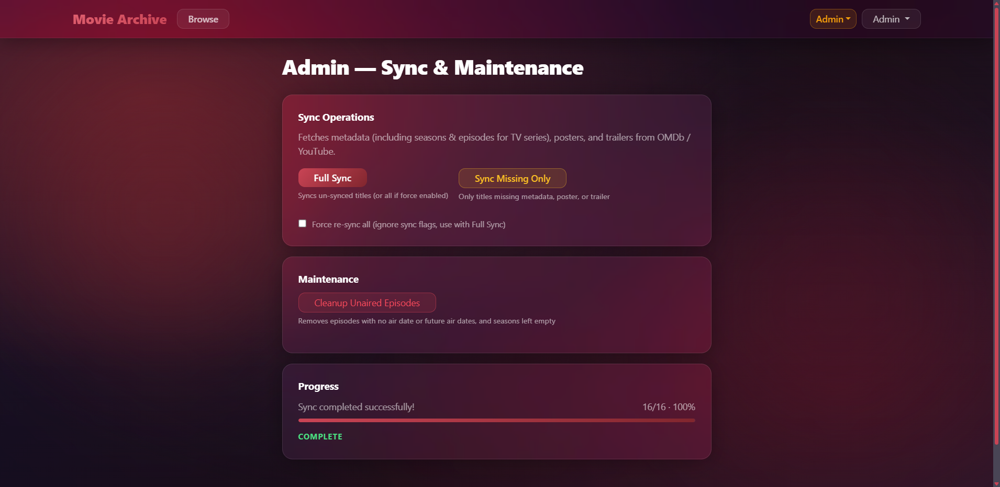 |

### Smart Poster Fallback

During the OMDb sync, if a show has no `poster_url` in the database the backend extracts the `Poster` field directly from the already-fetched OMDb API response and saves it. The frontend `PosterImage` component then simply renders `poster_url`; if the URL breaks it hides the image.

### Validation Coverage

| Layer | Mechanism | Example |
|-------|-----------|---------|
| HTML5 | `required`, `type`, `min`, `max`, `minLength` | Empty login fields, year range clamp |
| React (JS) | Check before API call | Password confirmation mismatch |
| Pydantic | `Field()` constraints, `@model_validator` | `rating` must be 1–10; `imdb_id` matches `^tt\d+$` |
| Database | `CHECK`, `UNIQUE`, `BETWEEN`, FK constraints | `rating BETWEEN 1 AND 10`; duplicate watch history prevented |
| HTTP | `HTTPException` with semantic status codes | 409 duplicate email, 403 non-admin tag operation, 401 expired token |

---

## 5. Week 1 — Web Fundamentals

### Web Evolution & the Client-Server Model

Movie Archive is a **Web 2.0** application: a React Single-Page Application on the client communicates with a FastAPI server over HTTP. The browser never does a full-page reload; React re-renders only the changed component subtree. All data flows as JSON over HTTP/HTTPS.

```
Browser (React SPA)  ──HTTP/JSON──►  FastAPI (port 8000)  ──SQL──►  MySQL
     localhost:5173                    localhost:8000
```

The DNS lookup and IP routing lifecycle applies: when the browser makes `GET http://localhost:8000/shows`, it resolves `localhost` → `127.0.0.1`, opens a TCP connection to port 8000, and the FastAPI Uvicorn server handles the request.

### URL Anatomy

Every API endpoint follows the full URL structure deliberately:

```
http://localhost:8000/shows/42?genre_id=3&min_rating=7.0
│         │          │     │  └─────────────── Query parameters (optional filters)
│         │          │     └───────────────── Path parameter (show_id = 42)
│         │          └─────────────────────── Resource path (/shows)
│         └────────────────────────────────── Host + port
└──────────────────────────────────────────── Protocol
```

### HTTP Methods & Status Codes

All four primary HTTP methods are used with correct REST semantics:

```python
# backend/routers/watchlists.py
@router.get("", ...)                         # GET    — read all watchlists
@router.post("", status_code=201)            # POST   — create, returns 201 Created
@router.delete("/{id}", status_code=204)     # DELETE — remove, returns 204 No Content

# backend/routers/ratings.py
@router.put("/{show_id}", ...)               # PUT    — full update of a rating
```

Status codes are always semantic:

```python
raise HTTPException(status_code=404, detail="Show not found.")
raise HTTPException(status_code=409, detail="An account with this email already exists.")
raise HTTPException(status_code=403, detail="You do not have permission to access this resource.")
raise HTTPException(status_code=401, detail="Token is invalid or has expired.")
raise HTTPException(status_code=400, detail="Only .csv files are accepted.")
```

### The Three Pillars of Frontend

**HTML — Structure.** `frontend/index.html` is the minimal shell (`<div id="root">`). All structure is generated dynamically by React as JSX. Semantic HTML elements are used throughout: `<nav>`, `<form>`, `<table>`, `<button type="submit">`, `<input type="email">`.

**CSS — Style.** `frontend/src/index.css` implements the complete design system using:

- **CSS custom properties** for theming: `--accent: #c94455`, `--glass`, `--danger`
- **Flexbox** for all layouts: `display: flex`, `gap`, `align-items`, `justify-content`
- **Box model** explicitly on every panel: `padding`, `border`, `border-radius`, `box-shadow`
- `backdrop-filter: blur(16px) saturate(180%)` for the frosted-glass effect
- Bootstrap 5 overridden with `!important` where its opaque backgrounds would break the glass effect

```css
/* index.css — box model + flexbox applied */
.g-panel {
  background: rgba(255, 255, 255, 0.05);        /* semi-transparent fill */
  border: 1px solid rgba(255, 255, 255, 0.10);  /* 1px border */
  border-radius: 16px;                           /* rounded corners */
  box-shadow: 0 8px 32px rgba(0, 0, 0, 0.4);    /* depth shadow */
  padding: 1.5rem;                               /* inner spacing */
}
```

**JavaScript — Behaviour.** All interactivity is event-driven via React's synthetic event system. No direct DOM manipulation is ever performed:

```jsx
// MovieCard.jsx — event listener driving a DOM class change via state
const [hovered, setHovered] = useState(false)

<div
  style={hovered ? GLASS_CARD_HOVER : GLASS_CARD}
  onMouseEnter={() => setHovered(true)}
  onMouseLeave={() => setHovered(false)}
>
```

### The DOM & React's Virtual DOM

React's virtual DOM means `document.querySelector` and `.innerHTML` are never called. State changes cause React to diff the new JSX against the previous render and apply the minimum patch to the real DOM. The browser parses `index.html` into a DOM tree, but React owns that tree from `<div id="root">` downwards.

### Backend Framework (FastAPI)

FastAPI replaces manual PHP routing, templating, DB wiring, and security headers in a single framework:

```python
# backend/main.py
app = FastAPI(title="Movie Archive API", version="1.0.0", lifespan=lifespan)
app.add_middleware(CORSMiddleware, allow_origins=["http://localhost:5173"], ...)
app.include_router(shows.router)
app.include_router(users.router)
app.include_router(ratings.router)
app.include_router(history.router)
app.include_router(watchlists.router)
app.include_router(tags.router)
app.include_router(external.router)
```

---

## 6. Week 2 — Database Design & FastAPI

### Relational Database Design

The schema has **15 tables** in a normalised relational model with explicit primary keys, foreign keys, composite keys, unique constraints, and cascade rules:

```
users ──< watchlists ──< watchlist_items >── shows
                                              │
                                              ├──< show_genres   >── genres
                                              ├──< show_directors>── directors
                                              ├──< show_actors   >── actors
                                              ├──< show_tags     >── tags
                                              └──< seasons ──────< episodes

users ──< user_ratings >── shows
users ──< watch_history>── shows
```

**One-to-many** — one user owns many watchlists:

```sql
-- db/1- Movie_Archive_DB.sql
create table watchlists (
    watchlist_id int auto_increment primary key,
    user_id      int NOT NULL,
    name         varchar(100) NOT NULL,
    foreign key (user_id) references users(user_id) ON DELETE CASCADE
);
```

**Many-to-many** — shows belong to many genres, genres apply to many shows:

```sql
create table show_genres (
    show_id  int NOT NULL,
    genre_id int NOT NULL,
    primary key (show_id, genre_id),
    foreign key (show_id)  references shows(show_id)  ON DELETE CASCADE,
    foreign key (genre_id) references genres(genre_id) ON DELETE CASCADE
);
```

**Many-to-many with payload** — `show_tags` carries `tagged_by_user_id` and `tagged_at` beyond the join keys:

```sql
CREATE TABLE show_tags (
    show_id           INT      NOT NULL,
    tag_id            INT      NOT NULL,
    tagged_by_user_id INT      NOT NULL,
    tagged_at         DATETIME NOT NULL DEFAULT CURRENT_TIMESTAMP,
    PRIMARY KEY (show_id, tag_id, tagged_by_user_id),
    FOREIGN KEY (show_id)           REFERENCES shows(show_id)  ON DELETE CASCADE,
    FOREIGN KEY (tag_id)            REFERENCES tags(tag_id)    ON DELETE CASCADE,
    FOREIGN KEY (tagged_by_user_id) REFERENCES users(user_id)  ON DELETE CASCADE
);
```

**Stored Procedures** encapsulate write business logic in the database layer:

```sql
-- db/2- Procedures.sql
CREATE PROCEDURE sp_rate_show(
    IN p_user_id INT, IN p_show_id INT, IN p_rating INT, IN p_review_text TEXT
)
BEGIN
    INSERT INTO user_ratings (user_id, show_id, rating, review_text, rated_at)
    VALUES (p_user_id, p_show_id, p_rating, p_review_text, NOW());

    -- Atomically marks as watched in the same call
    INSERT IGNORE INTO watch_history (user_id, show_id, watched_at)
    VALUES (p_user_id, p_show_id, NOW());
END
```

`INSERT IGNORE` + a `UNIQUE KEY` on `(user_id, show_id)` prevents duplicate watch-history entries at the database level — the safest place to enforce it.

### SQLModel ORM

Python classes map directly to database tables. The ORM provides type safety, auto-validation, and SQL-injection-proof parameterised queries:

```python
# backend/models.py
class UserRating(SQLModel, table=True):
    __tablename__ = "user_ratings"
    __table_args__ = (UniqueConstraint("user_id", "show_id", name="uq_user_show_rating"),)
    rating_id:   Optional[int]      = Field(default=None, primary_key=True)
    user_id:     int                = Field(foreign_key="users.user_id")
    show_id:     int                = Field(foreign_key="shows.show_id")
    rating:      int                = Field(ge=1, le=10)
    review_text: Optional[str]      = None
    rated_at:    datetime           = Field(default_factory=datetime.utcnow)
```

READ operations use raw `sqlalchemy.text()` queries (avoids PyMySQL "Commands out of sync" when mixing stored procs). WRITE operations use stored procedures where business logic is involved.

### REST Architecture

The API is resource-oriented — URLs are nouns, HTTP methods are verbs, all responses are JSON:

| Method | Path | Description |
|--------|------|-------------|
| GET | `/shows` | List all shows (filter params) |
| GET | `/shows/{id}` | Single show with full detail |
| GET | `/shows/genres` | All genres |
| GET | `/shows/{id}/seasons` | TV series seasons + episodes |
| POST | `/auth/register` | Create account, returns JWT |
| POST | `/auth/login` | Authenticate, returns JWT |
| GET | `/watchlists` | User's watchlists |
| POST | `/watchlists` | Create watchlist |
| DELETE | `/watchlists/{id}` | Delete watchlist |
| POST | `/watchlists/{id}/shows` | Add show to watchlist |
| DELETE | `/watchlists/{id}/shows/{show_id}` | Remove show |
| POST | `/ratings` | Rate a show (1–10) |
| GET | `/history` | User's watch history |
| POST | `/history/{show_id}` | Mark show as watched |
| POST | `/admin/upload-csv` | Bulk upload IMDb IDs |
| POST | `/admin/sync/start` | Start OMDb background sync |
| GET | `/admin/sync/status` | Poll sync progress |

### FastAPI — Path Parameters, Query Parameters, Documentation

```python
# backend/routers/shows.py
@router.get("/{show_id}", response_model=ShowDetailResponse)
def show_detail(show_id: int, ...):        # ← path parameter: extracted from URL

@router.get("", response_model=list[ShowResponse])
def list_shows(
    genre_id:   Optional[int]     = Query(None),           # ← optional query param
    min_year:   Optional[int]     = Query(None, ge=1888),  # ← with server-side validation
    search:     Optional[str]     = Query(None, max_length=200),
    ...
):
```

FastAPI auto-generates Swagger UI at `/docs` from Python type hints — zero manual documentation effort.

### Database Session as a Dependency

```python
# backend/database.py
def get_session():
    with Session(engine) as session:
        yield session       # FastAPI injects this into any route that declares it

# backend/routers/shows.py — usage
def list_shows(..., session: Session = Depends(get_session)):
    return services.get_shows(filters, session)
```

---

## 7. Week 3 — Production-Ready APIs & External Integrations

### Pydantic Validation — Automatic 422 Responses

Invalid input returns `422 Unprocessable Entity` before the route handler runs:

```python
# backend/schemas.py
class RatingCreate(BaseModel):
    show_id:     int           = Field(gt=0)
    rating:      int           = Field(ge=1, le=10)           # 1–10 enforced
    review_text: Optional[str] = Field(default=None, max_length=2000)

class ShowCreate(BaseModel):
    imdb_id: str = Field(
        min_length=3, max_length=20,
        pattern=r"^tt\d+$"                                   # regex validation
    )

class UserCreate(BaseModel):
    first_name: str = Field(min_length=2, max_length=50)
    email:      EmailStr                                      # format-validated email
    password:   str = Field(min_length=6, max_length=128)
```

### Cross-Field Validation with `@model_validator`

```python
# backend/schemas.py
class UserCreate(BaseModel):
    password:         str = Field(min_length=6)
    confirm_password: str

    @model_validator(mode="after")
    def passwords_match(self):
        if self.password != self.confirm_password:
            raise ValueError("Passwords do not match.")
        return self

class FilterParams(BaseModel):
    min_year: Optional[int] = Field(default=None, ge=1888, le=2030)
    max_year: Optional[int] = Field(default=None, ge=1888, le=2030)

    @model_validator(mode="after")
    def check_year_range(self):
        # Silently correct an inverted range rather than rejecting the request
        if self.min_year and self.max_year and self.min_year > self.max_year:
            self.min_year, self.max_year = self.max_year, self.min_year
        return self
```

### Schema Separation

Each entity has distinct schemas preventing over-exposure of sensitive data:

| Schema | Purpose |
|--------|---------|
| `UserCreate` | Accepts `password` + `confirm_password` from client |
| `TokenResponse` | Returns only `access_token` + safe `UserResponse` — **hash never sent** |
| `ShowCreate` | Only `imdb_id` — all other fields come from OMDb sync |
| `ShowResponse` | Public list — no internal fields, includes `platform_avg` computed aggregate |
| `ShowDetailResponse` | Extends `ShowResponse` with genres, cast, tags, reviews, seasons, `is_watched` |
| `HistoryResponse` | Flattened join result — hides raw `history_id`, exposes `imdb_id` for poster fallback |

### Error Handling

All errors use `HTTPException` with the correct semantic status code:

```python
# backend/services.py
raise HTTPException(status_code=404, detail="Show not found.")
raise HTTPException(status_code=409, detail="An account with this email already exists.")
raise HTTPException(status_code=403, detail="You do not have permission to access this resource.")
raise HTTPException(status_code=401, detail="Token is invalid or has expired.")
raise HTTPException(status_code=400, detail="A sync is already in progress.")
```

The frontend `ErrorBanner` component renders the `detail` string directly:

| Wrong credentials (401) | Already rated (409) |
|---|---|
| 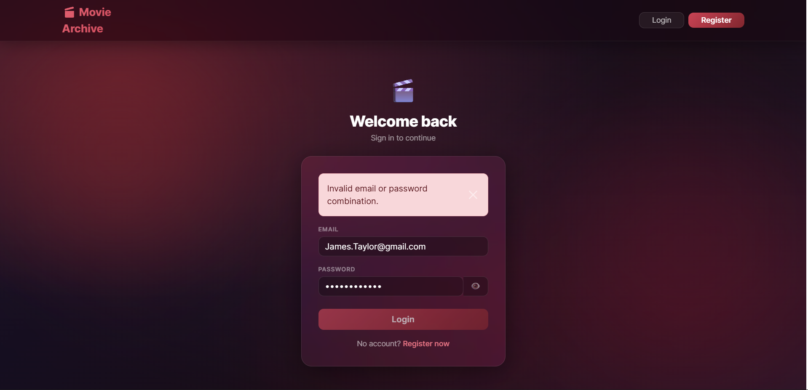 | 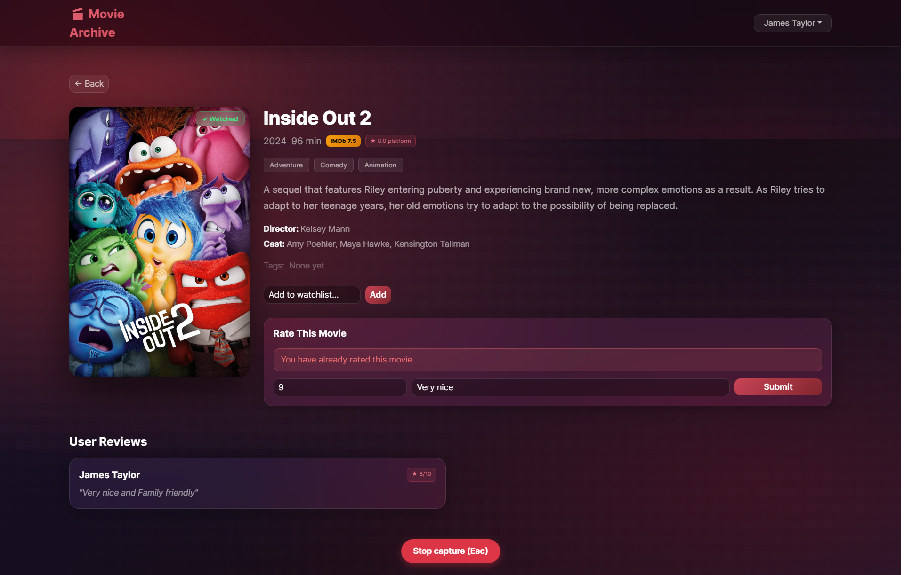 |

### Service Layer Architecture

Routes are intentionally thin. All business logic lives in `services.py`, keeping routes to 3–5 lines:

```python
# backend/routers/ratings.py — thin route
@router.post("", response_model=RatingResponse, status_code=201)
def create_rating(
    data: RatingCreate,
    session: Session = Depends(get_session),
    current_user: dict = Depends(get_current_user),
):
    return services.rate_show(current_user["user_id"], data, session)
```

`services.rate_show` then handles: verify the show exists → call `sp_rate_show` stored procedure → re-query the row with user name joined → return dict matching `RatingResponse`. This separation makes each function individually testable.

### External API Integration — OMDb + httpx

The backend acts as an HTTP client to [OMDb](https://www.omdbapi.com/) using the async `httpx` library. A shared `AsyncClient` is created once at startup via FastAPI's lifespan context:

```python
# backend/main.py
@asynccontextmanager
async def lifespan(app: FastAPI):
    global http_client
    http_client = httpx.AsyncClient(timeout=httpx.Timeout(5.0))
    yield
    await http_client.aclose()
```

The sync service handles OMDb edge cases, including the `Year` field returning `"2011–2019"` (en-dash range) for TV series instead of a plain integer:

```python
# backend/services.py
raw_year = api_data.get("Year", "")
if raw_year and raw_year != "N/A":
    try:
        start_year = int(str(raw_year).split("–")[0].split("-")[0].strip())
        updates.append(("release_year", start_year))
    except (ValueError, IndexError):
        pass
```

### OMDb Sync — Full Data Mapping

When the admin triggers a sync, every show in the database is enriched in a single background pass. The sync pipeline for each title is:

```
fetch OMDb metadata (title, plot, rating, runtime, year, type, poster)
        │
        ├── update shows row
        │
        ├── genres   → INSERT IGNORE into genres + INSERT IGNORE into show_genres
        ├── actors   → INSERT IGNORE into actors + INSERT IGNORE into show_actors
        ├── directors→ INSERT IGNORE into directors + INSERT IGNORE into show_directors
        │
        ├── if poster_url missing → extract Poster from response → UPDATE shows
        │
        └── if type == "series"
                └── for each season → GET /omdb?Season=N
                        └── for each episode → UPSERT into seasons + episodes
```

**Genres, actors, and directors** are all handled with the same idempotent pattern — `INSERT IGNORE` on the entity table guarantees no duplicates, then a second `INSERT IGNORE` on the mapping table links it to the show. Running the sync multiple times is safe:

```python
# backend/services.py — genre mapping (actors and directors follow the same pattern)
genre_str = api_data.get("Genre", "")   # e.g. "Action, Drama, Thriller"
if genre_str and genre_str != "N/A":
    for genre in [g.strip() for g in genre_str.split(",") if g.strip()]:
        # Add genre if it doesn't exist yet — silently skip if it does
        session.execute(
            text("INSERT IGNORE INTO genres (name) VALUES (:name)"), {"name": genre}
        )
        row = session.execute(
            text("SELECT genre_id FROM genres WHERE name = :name"), {"name": genre}
        ).fetchone()
        # Link to this show — silently skip if already linked
        session.execute(
            text("INSERT IGNORE INTO show_genres (show_id, genre_id) VALUES (:sid, :gid)"),
            {"sid": show_id, "gid": row[0]},
        )
```

The same pattern repeats for actors (`show_actors`) and directors (`show_directors`). A genre like "Drama" that appears in 50 shows is stored once in the `genres` table and linked 50 times in `show_genres` — the relational model is always maintained correctly regardless of sync order.

**Show metadata fields** are updated selectively — only fields that have actually changed are written:

```python
# backend/services.py
for api_key, db_col in [("Title", "title"), ("Plot", "plot"), ("imdbRating", "imdb_rating")]:
    val = api_data.get(api_key)
    if val and val != "N/A" and str(val) != str(show.get(db_col)):
        updates.append((db_col, val))   # only update if the value changed
```

**TV series** require an additional API call per season. Seasons and episodes are upserted with `ON DUPLICATE KEY UPDATE` so re-running the sync refreshes episode data (titles, air dates, ratings) without creating duplicates:

```python
# backend/services.py
session.execute(text("""
    INSERT INTO seasons (show_id, season_number, episode_count)
    VALUES (:sid, :snum, :ecnt)
    ON DUPLICATE KEY UPDATE episode_count = :ecnt
"""), {"sid": show_id, "snum": season_num, "ecnt": len(episodes_raw)})

# Each episode:
session.execute(text("""
    INSERT INTO episodes (season_id, episode_number, title, air_date, imdb_rating, imdb_id)
    VALUES (:sid, :enum, :title, :adate, :rating, :imdb_id)
    ON DUPLICATE KEY UPDATE title = :title, air_date = :adate, imdb_rating = :rating
"""), {...})
```

**Error isolation** — if one show's API call fails (e.g. OMDb has no record for that IMDb ID), the session is rolled back for that show only and the sync continues with the next:

```python
for show in shows:
    try:
        data = await fetch_omdb_movie(show["imdb_id"], client)
        _apply_omdb_data(show, data, session)
        ...
    except Exception:
        session.rollback()   # one bad show doesn't poison the whole sync
```

For TV series, a second API pass fetches each season:

```python
async def _sync_tv_seasons(show_id, imdb_id, total_seasons, session, client):
    for season_num in range(1, total_seasons + 1):
        resp = await client.get(
            "https://www.omdbapi.com/",
            params={"apikey": settings.omdb_api_key, "i": imdb_id, "Season": season_num}
        )
        data = resp.json()
        # Upsert season row, then upsert each episode with ON DUPLICATE KEY UPDATE
```

### Environment Variables & API Key Security

All secrets are in `.env`, never committed to version control:

```python
# backend/config.py
from pydantic_settings import BaseSettings

class Settings(BaseSettings):
    db_host: str;  db_port: int;  db_user: str;  db_password: str;  db_name: str
    secret_key: str
    omdb_api_key: str
    admin_user_id: int = 1
    access_token_expire_minutes: int = 60
    algorithm: str = "HS256"

    class Config:
        env_file = ".env"
```

### Background Tasks & Polling

The OMDb sync is a long-running operation. FastAPI's `BackgroundTasks` runs it off the HTTP request thread, returning `202 Accepted` immediately:

```python
# backend/routers/external.py
@router.post("/sync/start", status_code=202)
async def start_sync(background_tasks: BackgroundTasks, ...):
    background_tasks.add_task(services.run_full_sync, session, client)
    return {"detail": "Sync started. Poll GET /admin/sync/status for progress."}
```

The frontend uses the **polling** pattern — it calls the status endpoint every 2 seconds and updates the progress bar:

```jsx
// frontend/src/pages/AdminSyncPage.jsx
intervalRef.current = setInterval(async () => {
  const { data } = await api.get('/admin/sync/status')
  setStatus(data)
  if (data.status === 'complete' || data.status === 'error') stopPolling()
}, 2000)
```

| Sync in progress | Sync complete |
|---|---|
|  |  |

### JWT Authentication

Tokens are signed with `HS256` using `python-jose`. The dependency chain enforces authentication at the route level without touching route logic:

```python
# backend/dependencies.py
def get_current_user(token=Depends(oauth2_scheme), session=Depends(get_session)) -> dict:
    payload = decode_access_token(token)   # raises 401 if invalid/expired
    return get_user_by_id(payload["user_id"], session)

def require_admin(current_user=Depends(get_current_user)) -> dict:
    if current_user["user_id"] != settings.admin_user_id:
        raise HTTPException(status_code=403, detail="Admin access required.")
    return current_user
```

---

## 8. Week 4 — React + Vite Frontend

### The React Philosophy — Declarative UI

Instead of manually building and inserting DOM nodes, the UI is declared as a pure function of state. React computes what changed and patches only those DOM nodes:

```jsx
// Vanilla JS approach (what we avoid):
const li = document.createElement('li')
li.textContent = movie.title
document.querySelector('#list').appendChild(li)

// React declarative approach:
{shows.map(show => <MovieCard key={show.show_id} show={show} />)}
// React handles all DOM creation, updating, and removal
```

### JSX Syntax

JSX writes HTML-like markup inside JavaScript. The Vite/Babel transform compiles it to `React.createElement` calls at build time:

```jsx
// frontend/src/components/MovieCard.jsx
// camelCase attributes, className, self-closing, expressions in {}

```

### Components & Composition

The entire UI is a tree of isolated, reusable components. Each component is a plain JavaScript function returning JSX:

```
App
├── AmbientOrbs               fixed animated background orbs
├── Navbar                    sticky header, user + admin dropdowns
└── Routes
    ├── HomePage
    │   └── MovieCard[]       reused for every show in the grid
    ├── ShowDetailPage
    │   └── PosterImage       smart poster with OMDb fallback
    ├── WatchlistDetailPage
    │   └── PosterImage[]
    ├── HistoryPage
    │   └── PosterImage[]
    ├── LoginPage / RegisterPage
    ├── AdminUploadPage / AdminSyncPage
    └── ErrorBanner           reused across all pages
```

The `Navbar` component renders different dropdown menus depending on auth state. Authenticated users see a profile dropdown; admin users get an additional admin dropdown:

| User dropdown | Admin dropdown | Quick-add to watchlist (card hover) |
|---|---|---|
| 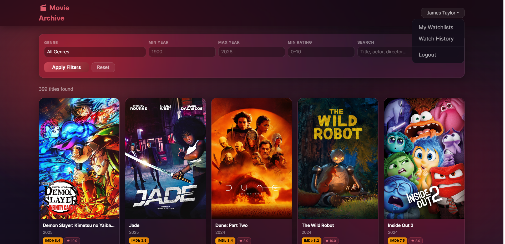 |  |  |

### Props — Read-Only Data Flow

Data flows strictly downward, from parent to child as immutable props:

```jsx
// frontend/src/pages/HomePage.jsx — parent passes show objects down
{shows.map(show => <MovieCard key={show.show_id} show={show} />)}

// frontend/src/components/MovieCard.jsx — child reads via destructured props
export default function MovieCard({ show }) {
  return (
    <div>
      
      <p>{show.title} ({show.release_year})</p>
    </div>
  )
}
```

To send data back up, parents pass callback functions as props. In `ShowDetailPage`, the `handleRate` function lives in the parent and is called from the child form's `onSubmit`.

### State & the Re-Render Cycle (`useState`)

`useState` drives all dynamic behaviour. When the setter is called, React schedules a re-render of just that component subtree:

```jsx
// frontend/src/pages/HomePage.jsx
const [shows,   setShows]   = useState([])          // API data
const [loading, setLoading] = useState(true)         // loading spinner
const [error,   setError]   = useState(null)         // error banner
const [filters, setFilters] = useState({
  genre_id: '', min_year: '', max_year: '', min_rating: '', search: ''
})

// Single-field update without mutating the existing object
onChange={e => setFilters(f => ({ ...f, genre_id: e.target.value }))}
```

Global authentication state is managed with React Context so any component in the tree can read it without prop drilling:

```jsx
// frontend/src/context/AuthContext.jsx
const AuthContext = createContext()

export function AuthProvider({ children }) {
  const [user,       setUser]      = useState(null)
  const [token,      setToken]     = useState(localStorage.getItem('token'))
  const [isLoggedIn, setIsLoggedIn]= useState(!!token)
  const [isAdmin,    setIsAdmin]   = useState(false)
  // ...
  return <AuthContext.Provider value={{ user, isLoggedIn, isAdmin, login, logout }}>
           {children}
         </AuthContext.Provider>
}

// Usage in any component:
const { isLoggedIn, isAdmin, user } = useAuth()
```

### Side Effects (`useEffect`)

Data fetching and other side effects are isolated inside `useEffect`, running after the DOM has been committed:

```jsx
// frontend/src/pages/HomePage.jsx
useEffect(() => {
  api.get('/shows/genres').then(r => setGenres(r.data)).catch(() => {})
  fetchShows({})
}, [])    // dependency array = [] → runs exactly once on mount

// frontend/src/pages/WatchlistsPage.jsx
useEffect(() => {
  if (!isLoggedIn) { navigate('/login'); return }   // protected route guard
  api.get('/watchlists')
    .then(r => setWatchlists(r.data))
    .catch(err => setError(err.response?.data?.detail ?? 'Failed to load.'))
}, [isLoggedIn])   // re-runs if auth state changes

// frontend/src/components/PosterImage.jsx — dependency array with values
useEffect(() => {
  if (!posterUrl && imdbId && !triedFallback.current) {
    triedFallback.current = true
    fetch(`https://www.omdbapi.com/?apikey=[YOUR_API_KEY]&i=${imdbId}`)
      .then(r => r.json())
      .then(data => { if (data.Poster !== 'N/A') setSrc(data.Poster) })
  }
}, [posterUrl, imdbId])   // re-runs when the show being displayed changes
```

### API Integration & CORS

All HTTP calls use a shared Axios instance that automatically attaches the stored JWT:

```javascript
// frontend/src/api/client.js
import axios from 'axios'

const api = axios.create({ baseURL: 'http://localhost:8000' })

api.interceptors.request.use(config => {
  const token = localStorage.getItem('token')
  if (token) config.headers.Authorization = `Bearer ${token}`
  return config
})

export default api
```

Because the frontend (port 5173) and backend (port 8000) have different origins, browsers block cross-origin requests. The FastAPI backend resolves this with `CORSMiddleware`:

```python
# backend/main.py
app.add_middleware(
    CORSMiddleware,
    allow_origins=["http://localhost:5173"],
    allow_credentials=True,
    allow_methods=["*"],
    allow_headers=["*"],
)
```

### Vite

Vite replaces Create React App and provides instant Hot Module Replacement (HMR). Saving a `.jsx` file updates the browser in under 100 ms without a full reload. The dev proxy in `vite.config.js` lets the frontend call `/api/...` during development without triggering CORS errors:

```javascript
// frontend/vite.config.js
export default defineConfig({
  plugins: [react()],
  server: {
    proxy: {
      '/api': {
        target: 'http://localhost:8000',
        changeOrigin: true,
        rewrite: path => path.replace(/^\/api/, ''),
      },
    },
  },
})
```

### Validation — End-to-End Coverage

| Screenshot | Validation Type | Where Enforced |
|---|---|---|
| 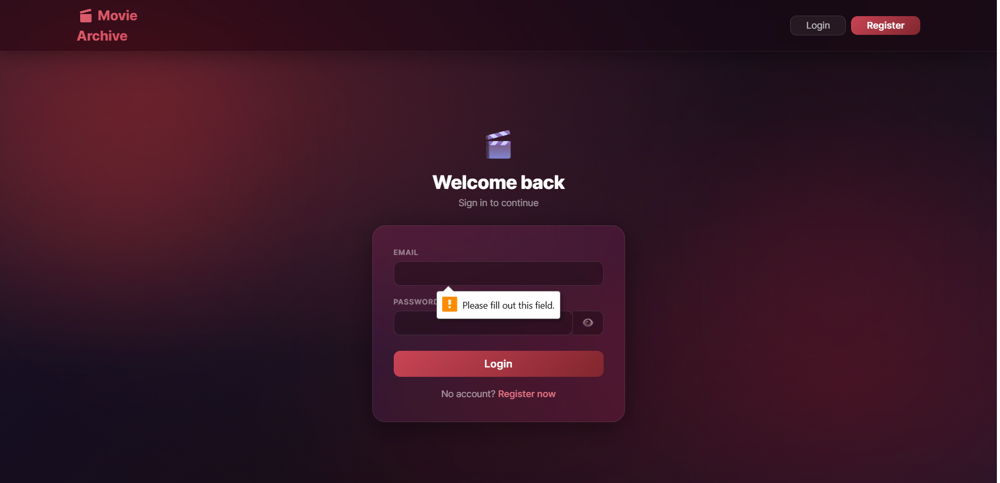 | Required fields — empty email | HTML5 `required` attribute |
|  | Wrong credentials | FastAPI `HTTPException` 401 |
| 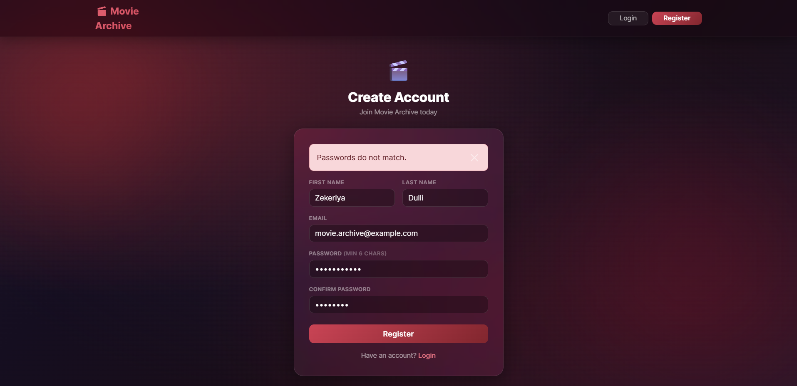 | Passwords don't match | React JS check + Pydantic `@model_validator` |
| 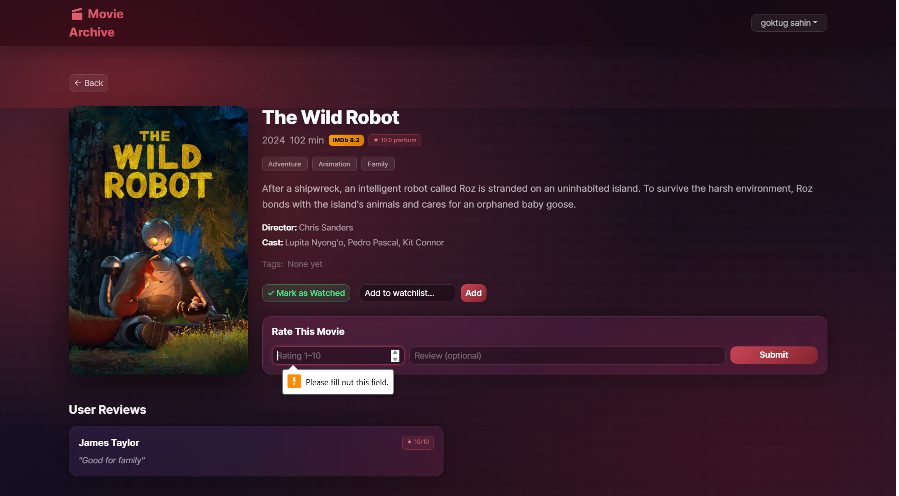 | Empty rating submitted | HTML5 `required` |
| 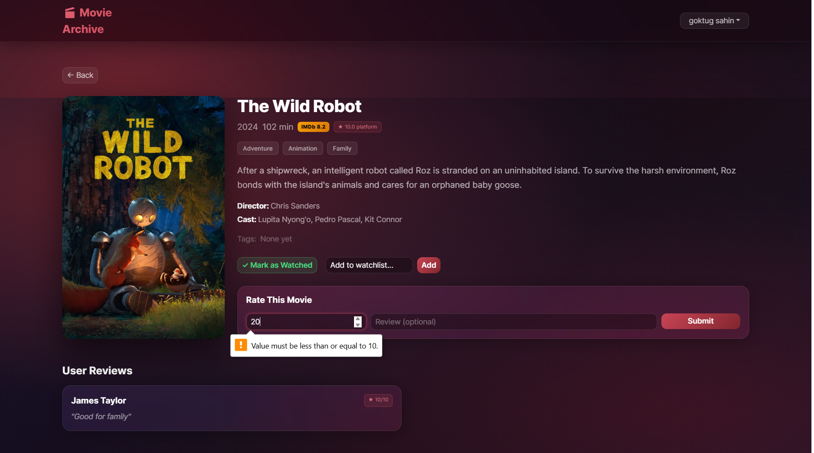 | Rating out of 1–10 range | HTML5 `max` + Pydantic `Field(ge=1, le=10)` |
|  | Rating a show twice | Database `UNIQUE(user_id, show_id)` → FastAPI `HTTPException` 409 |
| 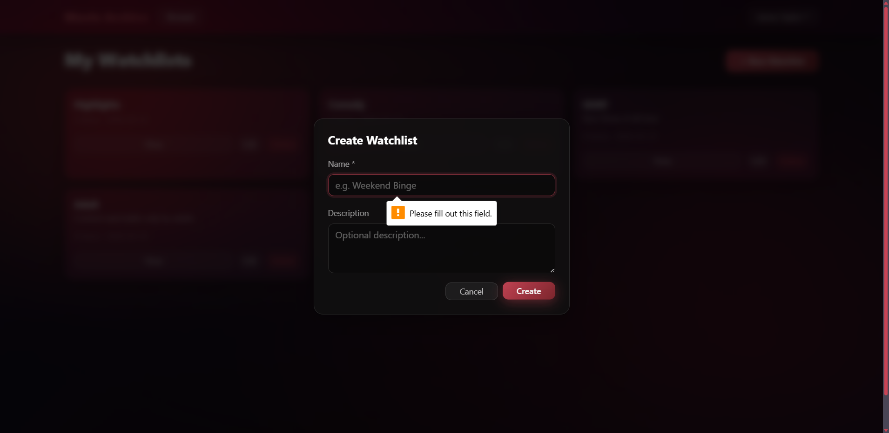 | Watchlist name required | HTML5 `required` |
| 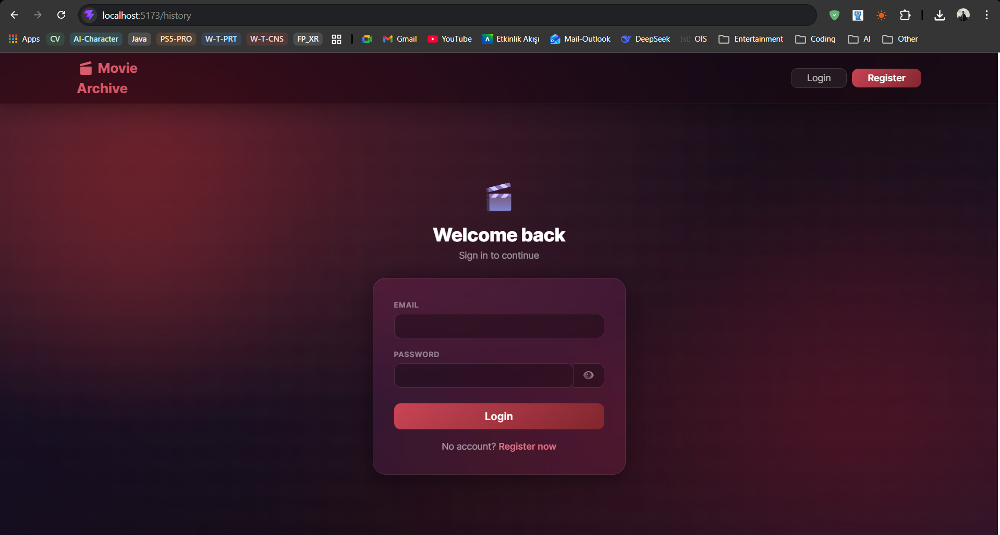 | Accessing protected route unauthenticated | React `useEffect` + `navigate('/login')` |

---

*Report prepared for ISU Web Programming — Project 1, Semester 6*
